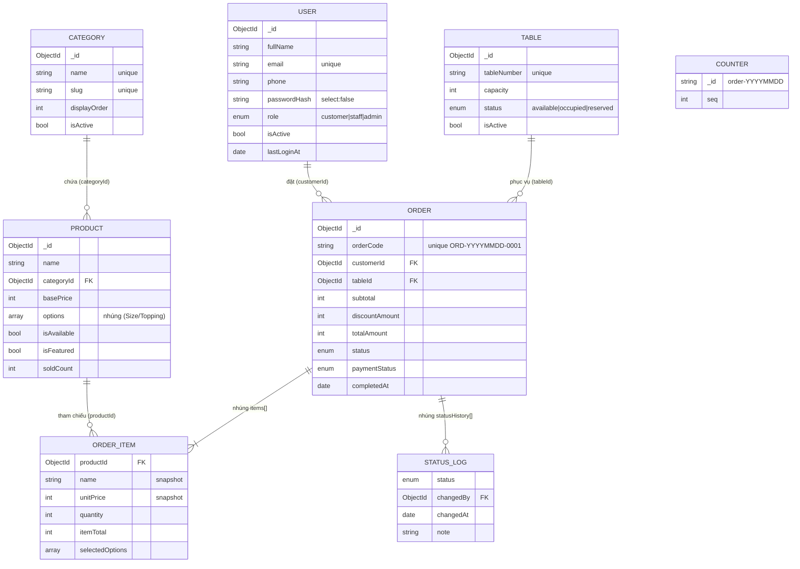
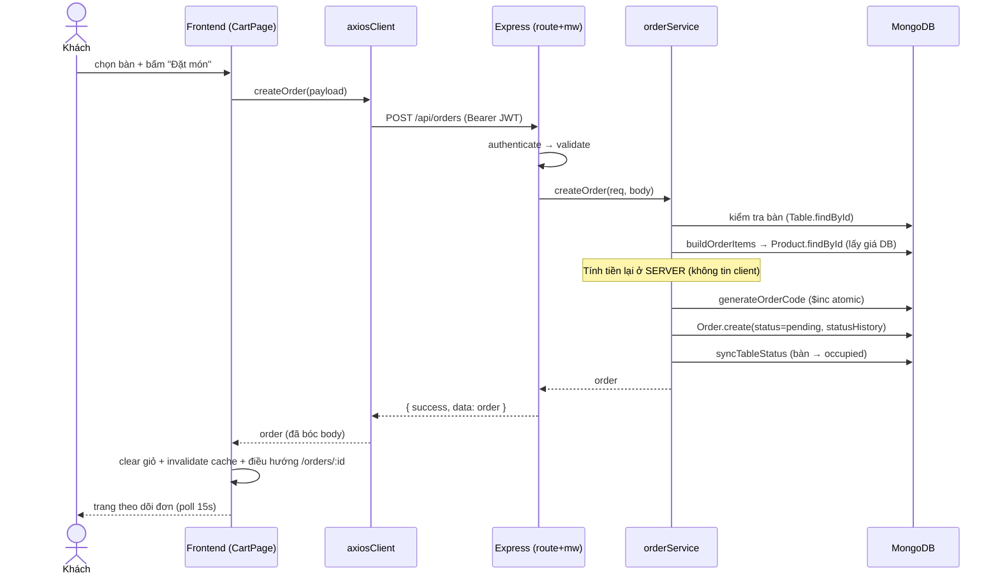
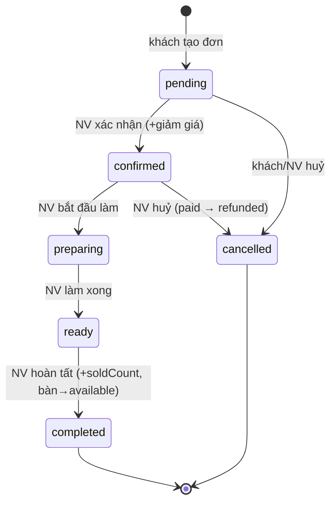

# FoodHub — Tài liệu kiến trúc & luồng hệ thống

> Tài liệu mô tả **toàn bộ luồng theo từng module**: Database → Backend → Frontend.
> Mục tiêu: khi báo cáo, hỏi bất kỳ chỗ nào "cái này để làm gì / chạy thế nào" đều trả lời được.
> Hệ thống: **FoodHub** — quản lý đặt món tại quán (cà phê / trà sữa / món ăn).

---

## Mục lục

1. [Tổng quan & công nghệ](#1-tổng-quan--công-nghệ)
2. [Kiến trúc tổng thể & vòng đời 1 request](#2-kiến-trúc-tổng-thể--vòng-đời-1-request)
3. [Tầng Database (MongoDB / Mongoose)](#3-tầng-database)
4. [Tầng Backend (Express)](#4-tầng-backend)
5. [Tầng Frontend (React)](#5-tầng-frontend)
6. [Các luồng nghiệp vụ end-to-end](#6-các-luồng-nghiệp-vụ-end-to-end)
7. [Bảng tra cứu API đầy đủ](#7-bảng-tra-cứu-api-đầy-đủ)
8. [Danh mục mã lỗi (errorCode)](#8-danh-mục-mã-lỗi)
9. [Phụ lục: quyết định thiết kế & cải tiến gần đây](#9-phụ-lục-quyết-định-thiết-kế--cải-tiến-gần-đây)

---

## 1. Tổng quan & công nghệ

### 1.1. Ba vai trò người dùng (role)

| Role | Quyền hạn |
|------|-----------|
| `customer` (khách) | Xem thực đơn, đặt món, theo dõi/sửa/huỷ đơn của mình (khi còn `pending`), quản lý hồ sơ |
| `staff` (nhân viên) | Mọi quyền khách + quản lý thực đơn/bàn, xử lý đơn (xác nhận, chế biến, huỷ, thu tiền), xem dashboard |
| `admin` (quản trị) | Mọi quyền staff + quản lý tài khoản người dùng (khoá/mở, phân quyền) |

### 1.2. Công nghệ

| Tầng | Công nghệ chính |
|------|-----------------|
| **Database** | MongoDB + Mongoose ODM |
| **Backend** | Node.js, Express 4, JWT (`jsonwebtoken`), `bcryptjs`, `express-validator`, `helmet`, `cors`, `express-rate-limit`, `morgan` |
| **Frontend** | React 19, Vite, React Router 7, TanStack Query 5, React Hook Form + Zod, Axios, Tailwind CSS 4, Headless UI, react-hot-toast, lucide-react, date-fns |

### 1.3. Mô hình 3 lớp ở backend (rất quan trọng khi báo cáo)

```
Route  →  Middleware  →  Controller  →  Service  →  Model (DB)
(định    (auth, RBAC,    (đọc req,     (NGHIỆP VỤ:   (schema +
 tuyến)   validate)       gọi service,  validate,     truy vấn
                          format res)    tính toán)    Mongo)
```

- **Controller** chỉ điều phối: lấy dữ liệu từ `req`, gọi `service`, trả response chuẩn. **Không chứa nghiệp vụ.**
- **Service** chứa **toàn bộ logic nghiệp vụ** (kiểm tra trạng thái, tính tiền, đồng bộ bàn...). Đây là nơi cần đọc kỹ nhất.
- **Model** định nghĩa schema, ràng buộc, index.

---

## 2. Kiến trúc tổng thể & vòng đời 1 request

### 2.1. Sơ đồ tổng thể

```
┌─────────────── FRONTEND (React, cổng 5173) ───────────────┐
│  Component (page/feature)                                  │
│      │ gọi hook                                            │
│  Hook (TanStack Query)  ── useQuery / useMutation          │
│      │ gọi hàm API                                         │
│  api/*.js  ── bọc axiosClient                              │
│      │ HTTP (Authorization: Bearer <JWT>)                  │
└──────┼────────────────────────────────────────────────────┘
       │  axiosClient interceptor: gắn token, bóc body, bắt 401
┌──────▼─────────────── BACKEND (Express, cổng 5050) ───────┐
│  app.js: helmet → cors → json → rate-limit → /api router  │
│      │                                                     │
│  routes/*.js  → middleware (authenticate, requireRole,     │
│                 validate) → controller                     │
│      │                                                     │
│  controllers/*.js  → services/*.js  (NGHIỆP VỤ)           │
│      │                                                     │
│  models/*.js (Mongoose)                                    │
└──────┼────────────────────────────────────────────────────┘
       │
┌──────▼──────┐
│   MongoDB   │  users, categories, products, tables, orders, counters
└─────────────┘
```

### 2.2. Vòng đời 1 request (ví dụ: khách bấm "Đặt món")

1. **FE component** `CartPage.submit()` gọi mutation `useCreateOrder()`.
2. Hook gọi `orderApi.createOrder(payload)` → `axiosClient.post("/orders", payload)`.
3. **Interceptor request**: tự gắn `Authorization: Bearer <token>` từ `localStorage`.
4. **Backend** nhận tại `POST /api/orders`:
   - `apiLimiter` (rate limit) → `authenticate` (giải mã JWT, nạp user) → `createOrderRules` + `validate` (kiểm tra dữ liệu) → `controller.createOrder`.
5. **Controller** gọi `orderService.createOrder(req, req.body)`.
6. **Service** (nghiệp vụ): kiểm tra bàn → dựng snapshot món + **tính tiền lại ở server** → sinh `orderCode` → `Order.create(...)` → đồng bộ trạng thái bàn.
7. **Response** chuẩn `{ success, message, data }` đi ngược về.
8. **Interceptor response** FE bóc `res.data`; hook `onSuccess` làm mới cache (`my-orders`, `staff-orders`, `dashboard`, `tables`) và điều hướng tới trang chi tiết đơn.

---

## 3. Tầng Database

> 6 collection. Điểm thiết kế cốt lõi: **đơn hàng lưu SNAPSHOT** (bản chụp tên/giá/tuỳ chọn lúc đặt) nên sửa giá/menu về sau **không làm sai đơn cũ**.

### 3.1. `users` — Tài khoản (`models/User.js`)

| Field | Kiểu | Ý nghĩa |
|-------|------|---------|
| `fullName` | String, bắt buộc | Họ tên |
| `email` | String, **unique**, lowercase | Đăng nhập bằng email |
| `phone` | String, regex `^0\d{9}$` | SĐT Việt Nam (10 số) |
| `passwordHash` | String, `select:false` | Mật khẩu đã hash bcrypt — **không bao giờ trả ra API** |
| `role` | enum `customer/staff/admin` | Phân quyền, có index |
| `avatarUrl`, `isActive`, `lastLoginAt` | | Ảnh đại diện, khoá tài khoản, lần đăng nhập cuối |
| `timestamps` | | `createdAt`, `updatedAt` tự động |

- **Method `comparePassword(plain)`**: so mật khẩu thô với hash (phải query kèm `.select("+passwordHash")`).
- `passwordHash` đặt `select:false` → mặc định mọi truy vấn **không lấy** trường này, an toàn.

### 3.2. `categories` — Danh mục (`models/Category.js`)

| Field | Ý nghĩa |
|-------|---------|
| `name` (unique), `slug` (unique, tự sinh) | Tên + slug URL-friendly |
| `description`, `imageUrl` | Mô tả, ảnh |
| `displayOrder` | Thứ tự hiển thị trên menu |
| `isActive` | Ẩn/hiện danh mục (soft delete) |

Index `{ isActive, displayOrder }` phục vụ lọc + sắp xếp menu.

### 3.3. `products` — Món (`models/Product.js`)

| Field | Ý nghĩa |
|-------|---------|
| `name`, `slug` (unique), `description` | Thông tin món |
| `categoryId` (ref Category) | Thuộc danh mục nào |
| `basePrice` | Giá gốc |
| `imageUrl` | Ảnh |
| `options` | **Mảng nhóm tuỳ chọn NHÚNG** (Size, Topping...) |
| `isAvailable` | Còn bán hay đã ẩn |
| `isFeatured` | Món nổi bật |
| `preparationTime`, `soldCount` | Thời gian làm, số đã bán (dùng thống kê) |

**Cấu trúc tuỳ chọn nhúng:**
- `option` (nhóm): `{ name, type: "single"|"multiple", required, choices[] }`
- `choice` (lựa chọn): `{ label, priceModifier }` — phụ phí cộng thêm.

Index: `{ isAvailable }`, và `name: "text"` (tìm kiếm).

### 3.4. `tables` — Bàn (`models/Table.js`)

| Field | Ý nghĩa |
|-------|---------|
| `tableNumber` (unique) | Số bàn |
| `capacity` | Sức chứa |
| `status` | `available` / `occupied` / `reserved` — **hệ thống tự đồng bộ** (trừ `reserved` đặt thủ công) |
| `qrCodeUrl`, `isActive` | QR, ẩn bàn (soft delete) |

### 3.5. `orders` — Đơn đặt món (`models/Order.js`) — **collection trọng tâm**

| Field | Ý nghĩa |
|-------|---------|
| `orderCode` (unique) | Mã đơn dạng `ORD-YYYYMMDD-0007` |
| `customerId` (ref User) + `customerInfo{fullName,phone}` | Khách đặt + **snapshot** thông tin |
| `tableId` (ref Table) + `tableNumber` | Bàn + **snapshot** số bàn |
| `items[]` | **Snapshot từng dòng món** (xem dưới) |
| `subtotal`, `discountAmount`, `totalAmount` | Tiền hàng, giảm giá, phải trả |
| `status` | `pending→confirmed→preparing→ready→completed` hoặc `cancelled` |
| `paymentStatus` | `unpaid` / `paid` / `refunded` |
| `paymentMethod` | `cash` / `card` / `ewallet` |
| `note`, `cancelReason` | Ghi chú, lý do huỷ |
| `confirmedBy`, `confirmedAt`, `completedAt` | Ai xác nhận, mốc thời gian |
| `statusHistory[]` | **Nhật ký mọi lần đổi trạng thái** (status, ai đổi, khi nào, ghi chú) |

**`orderItem` (snapshot bất biến):**
`{ productId, name, unitPrice, quantity, selectedOptions[], itemTotal, note }`
→ `name`, `unitPrice` là **bản chụp lúc đặt**. `itemTotal = (unitPrice + Σ priceModifier) × quantity`.

> **Tại sao snapshot?** Để khi admin sửa giá/tên món hoặc ẩn món, các đơn **đã đặt** vẫn giữ nguyên giá và tên đúng tại thời điểm khách đặt — không bị "trôi" theo menu hiện tại.

### 3.6. `counters` — Bộ đếm sinh mã đơn (`models/Counter.js`)

- Mỗi ngày 1 document: `{ _id: "order-20260621", seq: 7 }`.
- Sinh `orderCode` bằng `findOneAndUpdate + $inc` (**atomic**) → không trùng mã kể cả khi nhiều đơn tạo cùng lúc. (Hàm `utils/generateOrderCode.js`.)

### 3.7. Quan hệ giữa các collection

```
User(customer) ──< Order >── Table
                     │
                     └── items[].productId ──> Product ──> Category
Counter (độc lập, chỉ cấp số cho orderCode)
```

**Sơ đồ ERD (Mermaid):**



---

## 4. Tầng Backend

### 4.1. Cấu trúc thư mục

```
backend/src/
├── app.js            # Khởi tạo Express, middleware nền, mount /api, xử lý lỗi
├── server.js         # Điểm vào: validate env (fail-fast) → connectDB → listen
├── config/db.js      # Kết nối MongoDB
├── routes/           # Định tuyến mỗi module + routes/index.js gom lại
├── controllers/      # Điều phối req→service→res (KHÔNG nghiệp vụ)
├── services/         # NGHIỆP VỤ (đọc kỹ nhất)
├── models/           # Schema Mongoose
├── middlewares/      # auth, rbac, validate, errorHandler
├── validators/       # Rule express-validator mỗi module
├── utils/            # jwt, response, ApiError, asyncHandler, generateOrderCode, slugify, escapeRegex
└── seeds/seed.js     # Tạo dữ liệu mẫu
```

### 4.2. `app.js` — Pipeline middleware (thứ tự rất quan trọng)

```
helmet()                  → bảo mật HTTP header
cors({ origin: CLIENT })  → cho phép FE gọi
express.json()            → parse body JSON
morgan("dev")             → log request (chỉ dev)
apiLimiter  (/api)        → tối đa 600 req / 15 phút (chống lạm dụng)
authLimiter (/api/auth)   → tối đa 20 req / 15 phút (chống brute-force đăng nhập)
/api router               → toàn bộ API
notFoundHandler           → route không khớp → 404 chuẩn
errorHandler              → BẮT MỌI LỖI, trả format chuẩn (đặt cuối cùng)
```

`server.js`: hàm `validateEnv()` kiểm tra `JWT_SECRET`, `MONGODB_URI` ngay khi khởi động — thiếu thì thoát luôn (fail-fast), tránh lỗi mơ hồ về sau.

### 4.3. Middleware dùng chung

| File | Vai trò |
|------|---------|
| `middlewares/auth.js` (`authenticate`) | Đọc `Authorization: Bearer`, giải mã JWT, **nạp user từ DB mỗi request** để lấy role mới nhất + chặn ngay tài khoản bị khoá. Gắn `req.user = { userId, role, fullName, email }`. |
| `middlewares/rbac.js` (`requireRole`, `requireStaff`, `requireAdmin`) | Kiểm tra vai trò, đặt **sau** `authenticate`. |
| `middlewares/validate.js` | Đặt **sau** rule express-validator; có lỗi → ném `ApiError 422 VALIDATION_ERROR` kèm chi tiết từng field. |
| `middlewares/errorHandler.js` | Chuẩn hoá **mọi** lỗi về `{ success:false, message, errorCode, details? }`. Map sẵn: Mongoose ValidationError→422, CastError→400 INVALID_ID, trùng khoá 11000→409 (email→EMAIL_TAKEN), JWT lỗi/hết hạn→401. |

**Quyết định thiết kế #13 (JWT mỏng):** token **chỉ mang `userId`**. Role và trạng thái khoá luôn được nạp tươi từ DB ở mỗi request → giáng quyền/khoá tài khoản có hiệu lực ngay, không phải chờ token hết hạn.

### 4.4. Util dùng chung

| File | Vai trò |
|------|---------|
| `utils/jwt.js` | `signToken` / `verifyToken` (hết hạn mặc định `7d`) |
| `utils/response.js` | `sendSuccess` (200), `sendCreated` (201), `sendPaginated` (kèm `pagination{page,limit,total,totalPages}`) |
| `utils/ApiError.js` | Class lỗi nghiệp vụ + helper `badRequest/unauthorized/forbidden/notFound/conflict` |
| `utils/asyncHandler.js` | Bọc controller async để mọi lỗi tự chuyển tới `errorHandler` (khỏi try/catch lặp) |
| `utils/generateOrderCode.js` | Sinh `orderCode` atomic theo ngày |
| `utils/slugify.js` | Sinh slug tiếng Việt + `generateUniqueSlug` (thêm hậu tố `-2,-3` nếu trùng) |
| `utils/escapeRegex.js` | Thoát ký tự đặc biệt khi tìm kiếm `$regex` (chống ReDoS / kết quả sai) |

**Định dạng response chuẩn (SRS 7.5):**
```jsonc
// Thành công
{ "success": true, "message": "...", "data": {...} }
// Danh sách phân trang
{ "success": true, "data": [...], "pagination": { "page":1, "limit":20, "total":53, "totalPages":3 } }
// Lỗi
{ "success": false, "message": "...", "errorCode": "ORDER_NOT_EDITABLE", "details": [...] }
```

### 4.5. Module **Auth** (đăng ký / đăng nhập)

- **Route** (`authRoutes.js`): `POST /api/auth/register`, `POST /api/auth/login` (qua `authLimiter`).
- **Service** (`authService.js`):
  - `register`: hash mật khẩu bcrypt → tạo user role `customer` → ký JWT → trả `{ user (đã bỏ passwordHash), token }`. Email trùng → lỗi 11000 → `EMAIL_TAKEN`.
  - `login`: tìm theo email (kèm `+passwordHash`) → so mật khẩu. Sai email **hoặc** sai mật khẩu đều trả **chung** "Email hoặc mật khẩu không đúng" (`INVALID_CREDENTIALS`) để **không lộ** email nào tồn tại. Cập nhật `lastLoginAt`, trả JWT.

### 4.6. Module **User** (hồ sơ + quản trị tài khoản)

- **Route** (`userRoutes.js`):
  - `GET/PUT /api/users/me` 🔒 — hồ sơ cá nhân.
  - `GET /api/users` 👮admin — danh sách (lọc role, tìm kiếm fullName/email/phone, phân trang).
  - `PATCH /api/users/:id/status` 👮admin — khoá/mở + phân quyền.
- **Service** (`userService.js`):
  - `updateProfile`: đổi tên/SĐT/avatar; đổi mật khẩu **bắt buộc đúng `currentPassword`**. Email không cho đổi.
  - `updateUserStatus` — **2 guard quan trọng (#14)**:
    1. Không tự thao tác lên chính mình (`SELF_MODIFY`).
    2. Không khoá/giáng **admin hoạt động cuối cùng** (`LAST_ADMIN`) — đếm `activeAdmins`, nếu ≤1 thì chặn.

### 4.7. Module **Category** (danh mục)

- **Route** (`categoryRoutes.js`): `GET /` công khai (thêm `?all=true` để lấy cả danh mục ẩn — cho trang admin); `POST/PUT/DELETE` 👮staff.
- **Service** (`categoryService.js`):
  - `createCategory`/`updateCategory`: tự sinh slug; đổi tên thì sinh lại slug.
  - `deleteCategory`: **còn món → soft delete** (`isActive=false`, giữ lịch sử); **không còn món → xoá cứng**.

### 4.8. Module **Product** (món)

- **Route** (`productRoutes.js`): `GET /`, `GET /:id` công khai; `POST/PUT/DELETE` 👮staff.
- **Controller** (`productController.js`): `listProducts` đọc query `page/limit` (limit **cap 100**), `categoryId`, `search`, `sort`, `isAvailable`, `isFeatured` (`toBool` chuyển "true"/"false").
- **Service** (`productService.js`):
  - `listProducts`: filter `categoryId` / `name $regex (đã escape)` / `isAvailable` / `isFeatured`; `SORT_MAP`: `newest/oldest/price_asc/price_desc/popular`; populate tên danh mục; phân trang.
  - `createProduct`/`updateProduct`: chỉ nhận field trong danh sách `EDITABLE` (`pick`), kiểm tra danh mục tồn tại, sinh/regenerate slug.
  - `deleteProduct`: **ẩn món (`isAvailable=false`)** — soft delete để giữ lịch sử đơn. **Sửa giá không ảnh hưởng đơn cũ** nhờ snapshot ở Order.

### 4.9. Module **Table** (bàn) — có logic đồng bộ trạng thái

- **Route** (`tableRoutes.js`): `GET /` 🔒 (mọi user đăng nhập — để chọn bàn khi đặt); `POST/PUT/DELETE` 👮staff.
- **Service** (`tableService.js`):
  - `deleteTable`: bàn còn đơn đang phục vụ → chặn (`TABLE_HAS_ACTIVE_ORDERS`); ngược lại soft delete.
  - **`syncTableStatus(tableId)` — quyết định #1 (reference counting):** đếm số đơn "đang phục vụ" (`pending/confirmed/preparing/ready`) trên bàn:
    - ≥1 đơn → `occupied`; hết → `available`.
    - **Không động** vào bàn `reserved` (nhân viên đặt thủ công).
    - Được gọi **sau mỗi lần** tạo / đổi bàn / hoàn tất / huỷ đơn.

### 4.10. Module **Order** (đặt món) — **phần quan trọng nhất**

#### 4.10.1. Định tuyến (`orderRoutes.js`)

> Lưu ý: route tĩnh `/` và `/my` đặt **trước** `/:id` để không bị nuốt nhầm.

| Method + Path | Quyền | Việc |
|---------------|-------|------|
| `POST /api/orders` | 🔒 | Khách tạo đơn |
| `GET /api/orders/my` | 🔒 | Đơn của chính khách |
| `GET /api/orders/:id` | 🔒 chủ đơn/staff | Chi tiết đơn |
| `PUT /api/orders/:id` | 🔒 chủ đơn (pending) | Sửa đơn |
| `DELETE /api/orders/:id` | 🔒 chủ đơn (pending) | Khách tự huỷ |
| `GET /api/orders` | 👮staff | Danh sách tất cả đơn |
| `PATCH /api/orders/:id/confirm` | 👮staff | Xác nhận (+giảm giá) |
| `PATCH /api/orders/:id/status` | 👮staff | Chuyển trạng thái chế biến |
| `PATCH /api/orders/:id/cancel` | 👮staff | Nhân viên huỷ |
| `PATCH /api/orders/:id/payment` | 👮staff | Cập nhật thanh toán |

#### 4.10.2. Service (`orderService.js`) — các hàm trụ cột

**`buildOrderItems(items)` — dựng snapshot + tính tiền ở SERVER (không tin client):**
1. Mỗi món: kiểm tra tồn tại, `isAvailable`, danh mục không ẩn (`PRODUCT_UNAVAILABLE`).
2. Validate `selectedOptions`:
   - Nhóm phải thuộc món (`OPTION_INVALID_GROUP`).
   - Nhóm `required` phải chọn (`OPTION_REQUIRED`).
   - Nhóm `single` chỉ được 1 (`OPTION_SINGLE_VIOLATION`).
   - Lựa chọn phải thuộc nhóm (`OPTION_INVALID_CHOICE`).
3. **`priceModifier` LẤY TỪ DB** (không tin giá client gửi lên).
4. Tạo snapshot `{ name, unitPrice, itemTotal = (unitPrice + Σ modifier) × quantity }`.

> Đây là điểm bảo mật mấu chốt: **toàn bộ tiền được tính lại ở backend**, client không thể gửi giá rẻ hơn để gian lận.

**`calcTotals(items, discount)`**: `subtotal = Σ itemTotal`; `discount` bị **kẹp trong `[0, subtotal]`**; `totalAmount = subtotal − discount`.

**`resolveCustomer`**: khách đặt cho chính mình; staff/admin được đặt hộ (`customerId` trong body) — quyết định #7.

**State machine trạng thái đơn (quyết định #9, chặt theo SRS):**
```
pending ──→ confirmed ──→ preparing ──→ ready ──→ completed
   │            │
   └──→ cancelled ←──┘        (completed, cancelled là trạng thái cuối)
```
```js
const TRANSITIONS = {
  pending:   ["confirmed", "cancelled"],
  confirmed: ["preparing", "cancelled"],
  preparing: ["ready"],
  ready:     ["completed"],
  completed: [], cancelled: [],
};
```

**Các hàm nghiệp vụ:**

| Hàm | Logic chính |
|-----|-------------|
| `createOrder` | Kiểm tra bàn → resolveCustomer → buildOrderItems → calcTotals → `generateOrderCode` → `Order.create` (status `pending`, ghi `statusHistory`) → `syncTableStatus`. |
| `getMyOrders` | Lọc theo `customerId` (+status), phân trang, mới nhất trước. |
| `getOrderById` | Chỉ **chủ đơn** hoặc **staff/admin** mới xem được (nếu không → 403). |
| `updateOrder` | Chỉ chủ đơn & `pending`. **Dựng lại snapshot theo giá hiện hành** (#16). Cập nhật **atomic có điều kiện** `{_id, customerId, status:"pending"}` (#10) → nếu đơn vừa đổi trạng thái thì chặn. Đổi bàn thì sync cả bàn cũ + mới. |
| `cancelOwnOrder` | Chỉ chủ đơn & `pending` → `cancelled` (lý do "Khách tự huỷ"), atomic, sync bàn. |
| `confirmOrder` | Chỉ `pending`→`confirmed`; giảm giá tuỳ chọn (chặn `> subtotal` → `DISCOUNT_TOO_LARGE`); ghi `confirmedBy/At`; atomic. |
| `updateOrderStatus` | Chỉ nhận `preparing/ready/completed`; kiểm tra theo `TRANSITIONS`. Khi `completed`: set `completedAt`, **cộng `soldCount` đúng 1 lần (#11)** nhờ cập nhật atomic theo trạng thái nguồn, rồi `syncTableStatus`. |
| `cancelOrderByStaff` | Chỉ `pending/confirmed`→`cancelled`; nếu đã `paid` → chuyển `refunded` (#4); sync bàn. |
| `updatePayment` | Cập nhật `paymentStatus`/`paymentMethod`; chặn nếu đơn `cancelled`. |

> **"Cập nhật atomic có điều kiện" (#10) là gì?** Dùng `findOneAndUpdate({_id, status: <trạng thái nguồn>}, ...)`. Nếu giữa lúc đọc và ghi có người khác đổi trạng thái, điều kiện không khớp → trả `null` → ta báo lỗi "đơn vừa thay đổi". Đây là cách **chống race condition** (2 người thao tác 1 đơn cùng lúc) mà không cần transaction.

#### 4.10.3. Dashboard (`dashboardService.js`) — chỉ 👮staff

- `GET /api/dashboard/summary`: số đơn theo trạng thái, tổng đơn, đơn tạo hôm nay; **doanh thu = Σ `totalAmount` đơn `completed`** gom theo `completedAt` (#8) cho hôm nay & tuần này.
- `GET /api/dashboard/top-products`: **aggregate trực tiếp từ `items` của đơn `completed`** (nguồn chân lý #12) — `$unwind` items → `$group` theo productId → tổng quantity/revenue → top N.

---

## 5. Tầng Frontend

### 5.1. Cấu trúc thư mục

```
frontend/src/
├── main.jsx            # Bọc app: QueryClient → Auth → Cart → Router → Toaster
├── App.jsx             # Định tuyến + lazy-load trang + ErrorBoundary
├── api/                # Bọc axiosClient theo từng resource
│   └── axiosClient.js  # baseURL, gắn token, bóc body, bắt 401
├── context/            # AuthContext (đăng nhập), CartContext (giỏ hàng)
├── hooks/              # Bọc TanStack Query (useMenu, useOrders, useStaffOrders...)
├── lib/                # Tiện ích: cn, format, constants, statusConfig, navigation
├── components/
│   ├── common/         # ProtectedRoute, ErrorBoundary, PageLoader, PageTransition
│   ├── layout/         # StorefrontLayout, AdminLayout, UserMenu
│   └── ui/             # Bộ UI tái dùng (Button, Modal, Drawer, Input...)
├── features/           # Khối UI theo nghiệp vụ (cart, menu, orders, dashboard, admin-*)
└── pages/              # Trang gắn vào route
```

### 5.2. Lớp dữ liệu 3 tầng ở FE

```
Component  →  Hook (TanStack Query)  →  api/*.js  →  axiosClient  →  Backend
```

- **`api/axiosClient.js`** — trục giao tiếp:
  - `baseURL = VITE_API_URL || http://localhost:5050/api`.
  - **Interceptor request**: gắn `Authorization: Bearer <token>` từ `localStorage`.
  - **Interceptor response**: bóc `res.data` (trả thẳng body chuẩn); chuẩn hoá lỗi về `{ message, errorCode, details, status }`.
  - **Bắt 401**: xoá token + phát sự kiện `foodhub:unauthorized` → đăng xuất mềm (xem 5.4).
- **`api/*.js`**: mỗi resource 1 file (`authApi`, `orderApi`, `productApi`...). Hàm mỏng, chỉ gọi axios và `.then(r => r.data)` (lấy phần `data`) — **trừ** các API danh sách phân trang (`getMyOrders`, `listOrders`, `getProducts`, `listUsers`) **giữ nguyên** cả body để có `pagination`.
- **Hooks (TanStack Query)**: `useQuery` (đọc) / `useMutation` (ghi). Sau khi ghi thành công → `invalidateQueries` để tự làm mới dữ liệu liên quan.

**Khoá cache (queryKey) chính:** `["products"]`, `["product", id]`, `["categories"]`, `["tables"]`, `["my-orders"]`, `["staff-orders"]`, `["order", id]`, `["users"]`, `["me"]`, `["dashboard", ...]`.

### 5.3. Định tuyến & bảo vệ route (`App.jsx`, `ProtectedRoute.jsx`)

- Trang **lazy-load** (chia nhỏ bundle), bọc `Suspense` + `ErrorBoundary`.
- `ProtectedRoute`: chưa đăng nhập → `/login` (lưu `state.from` để quay lại sau khi đăng nhập).
- `RoleRoute roles=[...]`: sai vai trò → `/403`.
- Cây route:
  - Công khai: `/login`, `/register`, `/` (menu), `/design-system` (chỉ dev).
  - 🔒 khách: `/cart`, `/orders`, `/orders/:id`, `/profile`.
  - 👮 `/admin/*` (staff/admin): dashboard, orders, categories, products, tables; **`/admin/users` chỉ admin**.

### 5.4. Context (trạng thái toàn cục)

**`AuthContext`** — đăng nhập:
- Lưu `user` + `token` (đồng bộ `localStorage`). Có `login/logout/updateUser`.
- Cờ tiện ích: `isAuthenticated`, `isCustomer`, `isStaff`, `isAdmin`.
- **Đọc `localStorage` an toàn** (try/catch, JSON hỏng không làm trắng app).
- **Đăng xuất mềm khi 401**: lắng nghe `foodhub:unauthorized` → clear state, `ProtectedRoute` tự đẩy về `/login` (không reload toàn trang, không mất form đang nhập).
- **Đồng bộ đa tab**: lắng nghe sự kiện `storage` → đăng xuất/đăng nhập ở 1 tab phản ánh sang tab khác.

**`CartContext`** — giỏ hàng (lưu `localStorage`):
- `addItem/updateQuantity/removeItem/clear`; tính `totalCount`, `subtotal`.
- Gộp dòng cùng cấu hình bằng **chữ ký option** (JSON, có cả `priceModifier` → không đụng độ).
- **Clamp số lượng** mỗi dòng ≤ 99, bỏ qua giá trị rác/NaN.
- **`reconcilePrices(productMap)`**: đồng bộ giá giỏ với thực đơn mới nhất (giỏ lưu lâu dài có thể lệch giá) — gọi ở `CartPage`.

### 5.5. `lib/` — tiện ích

| File | Vai trò |
|------|---------|
| `cn.js` | Ghép class Tailwind (clsx + tailwind-merge) |
| `format.js` | `formatVND` (chặn NaN → "0đ"), `formatDate`/`formatDay` (chặn ngày không hợp lệ, không throw) |
| `constants.js` | Enum đồng bộ backend: `ROLES`, `ORDER_STATUS`, **`NEXT_STATUS`** (bước chuyển hợp lệ để FE hiện đúng nút), `PAYMENT_*`, `TABLE_STATUS`, `OPTION_TYPE` |
| `statusConfig.js` | Map trạng thái → nhãn tiếng Việt + màu (cho `StatusPill`) |
| `navigation.js` | `homePathForRole` (khách → `/`, còn lại → `/admin`) |

### 5.6. Các luồng/feature ở FE

| Feature (thư mục) | Trang | Việc |
|-------------------|-------|------|
| `features/menu` + `MenuPage` | `/` | Duyệt thực đơn: hero + tìm kiếm, chips danh mục, lưới món, modal chi tiết. **Tìm kiếm + lọc danh mục đẩy xuống server**; **infinite scroll** (cuộn tải thêm) — duyệt hết menu, không giới hạn 100 món. Món nổi bật tải bằng query riêng. |
| `features/cart` + `CartPage` | giỏ + `/cart` | Drawer giỏ; trang đặt món: chọn bàn, ghi chú, **đồng bộ giá theo menu mới nhất**, gửi đơn (BE tính lại tiền), xoá giỏ **chỉ khi thành công**. |
| `features/orders` + `OrdersPage`/`OrderDetailPage` | `/orders`, `/orders/:id` | Danh sách đơn của khách; theo dõi đơn với **timeline trạng thái tự cập nhật (poll 15s)**; sửa/huỷ khi còn `pending`. |
| `features/admin-orders` + `AdminOrdersPage`/`AdminOrderDetailPage` | `/admin/orders` | NV lọc đơn (status/bàn/**khoảng ngày đúng timezone**), bảng (PC) / thẻ (mobile); `OrderActions` hiện đúng nút theo state machine: Xác nhận(+giảm giá **clamp [0, subtotal]**), chuyển trạng thái, Huỷ (**bắt buộc lý do**), Thanh toán. |
| `features/admin-menu` + `AdminCategoriesPage`/`AdminProductsPage` | `/admin/categories`, `/admin/products` | CRUD danh mục/món; `OptionsBuilder` dựng nhóm tuỳ chọn; **xoá mô tả khi sửa lưu được** (gửi `null`). |
| `features/admin-tables` + `AdminTablesPage` | `/admin/tables` | CRUD bàn; **xoá sức chứa khi sửa lưu được**. |
| `AdminUsersPage` | `/admin/users` (admin) | Danh sách user, khoá/mở, phân quyền. |
| `features/dashboard` + `DashboardPage` | `/admin` | KPI, biểu đồ đơn theo trạng thái, top món bán chạy. |

### 5.7. Bộ UI tái dùng (`components/ui`)

`Button, Input, Textarea, Select, PasswordInput, Modal, Drawer, Badge, Card, ConfirmDialog, EmptyState, Pagination, QuantityStepper, Skeleton, Spinner, StatusPill`. Modal/Drawer dùng Headless UI (đã có focus trap, ESC, khoá cuộn nền). Nút không submit có `type="button"`.

---

## 6. Các luồng nghiệp vụ end-to-end

### 6.1. Khách đặt món (luồng chính)

```
Menu (/) → chọn món → ProductDetailModal (chọn tuỳ chọn, số lượng) → addItem (CartContext)
   → Drawer giỏ → /cart → chọn bàn + ghi chú → "Đặt món"
   → POST /api/orders
       BE: kiểm tra bàn → buildOrderItems (snapshot + tính tiền) → tạo orderCode → Order.create(pending)
           → syncTableStatus (bàn → occupied)
   → FE: xoá giỏ, toast, điều hướng /orders/:id (theo dõi đơn, poll 15s)
```

**Sơ đồ tuần tự (Mermaid):**



### 6.2. Vòng đời trạng thái 1 đơn (phối hợp khách ↔ nhân viên)

```
Khách tạo:        pending      (bàn occupied)
NV xác nhận:      confirmed    (PATCH /confirm, +giảm giá)
NV bắt đầu làm:   preparing    (PATCH /status)
NV xong:          ready        (PATCH /status)
NV hoàn tất:      completed    (PATCH /status → +soldCount, completedAt, bàn → available)
NV thu tiền:      paid         (PATCH /payment)

Huỷ: khách (DELETE, chỉ pending) | NV (PATCH /cancel, pending/confirmed; nếu paid → refunded)
```

**Sơ đồ trạng thái (Mermaid):**



> Mỗi lần đổi trạng thái đều ghi `statusHistory` và **đồng bộ cache 2 chiều** ở FE: thao tác của khách làm mới `staff-orders/dashboard`, thao tác của NV làm mới `my-orders` — nên 2 phía không thấy dữ liệu cũ.

### 6.3. Đồng bộ trạng thái bàn (tự động)

`syncTableStatus` chạy sau tạo/sửa/huỷ/hoàn tất đơn → đếm đơn đang phục vụ trên bàn → `occupied`/`available`. Bàn `reserved` (NV đặt thủ công) không bị đụng.

### 6.4. Thống kê dashboard

`completed` là nguồn chân lý: doanh thu cộng `totalAmount` đơn completed (theo `completedAt`); top món aggregate từ `items` đơn completed. → số liệu nhất quán, không phụ thuộc `soldCount` rời rạc.

---

## 7. Bảng tra cứu API đầy đủ

> Tiền tố chung: `/api`. 🔓 công khai · 🔒 cần đăng nhập · 👮 staff/admin · 👑 chỉ admin.

| # | Method | Path | Quyền | Mô tả |
|---|--------|------|-------|-------|
| 1 | POST | `/auth/register` | 🔓 | Đăng ký (role customer) |
| 2 | POST | `/auth/login` | 🔓 | Đăng nhập, trả JWT |
| 3 | GET | `/users/me` | 🔒 | Hồ sơ của tôi |
| 4 | PUT | `/users/me` | 🔒 | Sửa hồ sơ / đổi mật khẩu |
| 5 | GET | `/users` | 👑 | Danh sách user (lọc role, tìm kiếm, phân trang) |
| 6 | PATCH | `/users/:id/status` | 👑 | Khoá/mở, phân quyền |
| 7 | GET | `/categories` | 🔓 | Danh mục (`?all=true` lấy cả ẩn) |
| 8 | POST | `/categories` | 👮 | Thêm danh mục |
| 9 | PUT | `/categories/:id` | 👮 | Sửa danh mục |
| 10 | DELETE | `/categories/:id` | 👮 | Xoá/ẩn danh mục |
| 11 | GET | `/products` | 🔓 | Danh sách món (lọc/tìm/sắp xếp/phân trang) |
| 12 | GET | `/products/:id` | 🔓 | Chi tiết món |
| 13 | POST | `/products` | 👮 | Thêm món |
| 14 | PUT | `/products/:id` | 👮 | Sửa món |
| 15 | DELETE | `/products/:id` | 👮 | Ẩn món |
| 16 | GET | `/tables` | 🔒 | Danh sách bàn |
| 17 | POST | `/tables` | 👮 | Thêm bàn |
| 18 | PUT | `/tables/:id` | 👮 | Sửa bàn |
| 19 | DELETE | `/tables/:id` | 👮 | Xoá/ẩn bàn |
| 20 | POST | `/orders` | 🔒 | Tạo đơn |
| 21 | GET | `/orders/my` | 🔒 | Đơn của tôi |
| 22 | GET | `/orders/:id` | 🔒 | Chi tiết đơn (chủ đơn/staff) |
| 23 | PUT | `/orders/:id` | 🔒 | Sửa đơn (pending) |
| 24 | DELETE | `/orders/:id` | 🔒 | Khách tự huỷ (pending) |
| 25 | GET | `/orders` | 👮 | Tất cả đơn (lọc status/bàn/ngày) |
| 26 | PATCH | `/orders/:id/confirm` | 👮 | Xác nhận (+giảm giá) |
| 27 | PATCH | `/orders/:id/status` | 👮 | Chuyển trạng thái chế biến |
| 28 | PATCH | `/orders/:id/cancel` | 👮 | NV huỷ (kèm lý do) |
| 29 | PATCH | `/orders/:id/payment` | 👮 | Cập nhật thanh toán |
| 30 | GET | `/dashboard/summary` | 👮 | Thống kê tổng quan |
| 31 | GET | `/dashboard/top-products` | 👮 | Món bán chạy |

---

## 8. Danh mục mã lỗi

| errorCode | HTTP | Khi nào |
|-----------|------|---------|
| `VALIDATION_ERROR` | 422 | Sai dữ liệu đầu vào (express-validator / Mongoose) |
| `INVALID_ID` | 400 | ObjectId sai định dạng |
| `UNAUTHORIZED` | 401 | Thiếu/sai/hết hạn token |
| `INVALID_CREDENTIALS` | 401 | Sai email hoặc mật khẩu |
| `ACCOUNT_LOCKED` | 401 | Tài khoản `isActive=false` |
| `FORBIDDEN` | 403 | Không đủ quyền (RBAC) |
| `NOT_FOUND` | 404 | Không tìm thấy tài nguyên |
| `EMAIL_TAKEN` / `DUPLICATE_KEY` | 409 | Trùng khoá unique |
| `SELF_MODIFY` / `LAST_ADMIN` | 409 | Guard quản trị user |
| `CURRENT_PASSWORD_REQUIRED` / `INVALID_CURRENT_PASSWORD` | 400 | Đổi mật khẩu |
| `PRODUCT_NOT_FOUND` / `PRODUCT_UNAVAILABLE` | 400/409 | Món không tồn tại / đã ẩn khi đặt |
| `OPTION_INVALID_GROUP` / `OPTION_REQUIRED` / `OPTION_SINGLE_VIOLATION` / `OPTION_INVALID_CHOICE` | 400 | Sai tuỳ chọn món |
| `TABLE_INACTIVE` / `TABLE_HAS_ACTIVE_ORDERS` | 409 | Bàn không khả dụng / còn đơn đang phục vụ |
| `ORDER_NOT_EDITABLE` | 409 | Sửa/huỷ đơn không còn `pending` |
| `INVALID_STATUS_TRANSITION` | 409 | Chuyển trạng thái sai state machine |
| `DISCOUNT_TOO_LARGE` | 400 | Giảm giá > tổng tiền |
| `ORDER_CANCELLED` | 409 | Thanh toán đơn đã huỷ |
| `INTERNAL_ERROR` | 500 | Lỗi không lường trước (bug) |

---

## 9. Phụ lục: quyết định thiết kế & cải tiến gần đây

### 9.1. Các quyết định thiết kế cốt lõi (nên thuộc khi báo cáo)

| # | Quyết định | Vì sao |
|---|-----------|--------|
| **Snapshot đơn** | `items` lưu bản chụp tên/giá/tuỳ chọn | Sửa menu **không** làm sai đơn cũ |
| **Tính tiền ở server** | `buildOrderItems` lấy giá từ DB | Chống client gian lận giá |
| #1 | Đồng bộ bàn bằng reference counting | Trạng thái bàn luôn đúng theo số đơn active |
| #9 | State machine trạng thái chặt | Không cho nhảy bước sai |
| #10 | Cập nhật atomic có điều kiện | Chống race condition không cần transaction |
| #11 | Cộng `soldCount` đúng 1 lần | Thống kê chính xác |
| #12 | Top món aggregate từ đơn completed | Một nguồn chân lý |
| #13 | JWT chỉ mang `userId`, nạp role tươi mỗi request | Giáng quyền/khoá có hiệu lực ngay |
| #14 | Guard `SELF_MODIFY` + `LAST_ADMIN` | Không tự khoá mình / mất admin cuối |
| **Soft delete** | Ẩn (`isActive`/`isAvailable=false`) thay vì xoá cứng | Giữ toàn vẹn lịch sử đơn |

### 9.2. Các cải tiến đã thực hiện (đợt review & sửa lỗi)

> Phần này để giải thích "đã làm gì để hệ thống tốt hơn". Mỗi mục đã được commit theo nhánh riêng và merge vào `main`.

**Nhóm đúng-sai (correctness):**
1. Đồng bộ **chéo cache đơn** khách ↔ nhân viên (FE) — tránh thao tác trên trạng thái cũ.
2. Đọc user từ `localStorage` an toàn (try/catch) — JSON hỏng không làm trắng app.
3. **Clamp giảm giá** về `[0, subtotal]` (FE + chốt chặn hook) — chặn giảm giá âm làm tăng tiền khách.
4. Xoá mô tả/sức chứa khi sửa **lưu được** (gửi `null` thay `undefined`).
5. Đăng nhập xong **quay lại đúng trang** bị chặn (`state.from`).
6. `formatVND` chặn `NaN` → "0đ".
7. `formatDate` chặn ngày không hợp lệ (không throw → không vỡ trang).

**Nhóm cải thiện trải nghiệm/độ bền:**
8. **Poll 15s** cho theo dõi đơn — timeline tự cập nhật.
9. **Đồng bộ giá giỏ** với thực đơn mới nhất + thông báo khi đổi giá.
10. **401 đăng xuất mềm** (không reload, giữ form đang nhập).
11. **Đồng bộ đăng nhập/xuất giữa các tab**.
12. **Chữ ký option** an toàn (JSON + priceModifier) — không gộp nhầm dòng giỏ.
13. `type="button"` + `aria-pressed` cho nút không submit.
14. **Clamp số lượng** giỏ ≤ 99, bỏ qua NaN.
15. **Bắt buộc lý do** khi nhân viên huỷ đơn.
16. **Tìm kiếm thực đơn server-side** — không bỏ sót món ngoài 100 món đầu.
17. Bộ **lọc ngày AdminOrders đúng timezone** (gửi mốc UTC rõ ràng).
18. **Infinite scroll** trang thực đơn — duyệt được toàn bộ menu.

---

*Tài liệu này phản ánh mã nguồn tại thời điểm viết. Khi thêm tính năng, cập nhật mục tương ứng (Database → Backend → Frontend) để giữ đồng bộ.*
